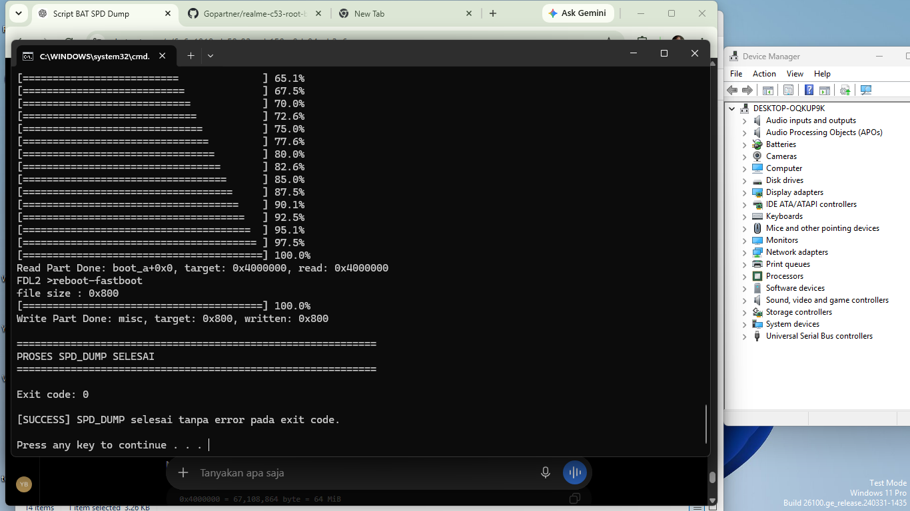

# Root Perangkat Android via BROM/SPD Dump (Magisk + Unisoc/SPD)

> **Metode root:** Magisk-patched `boot` + patched `vbmeta` dengan flag `AVB_VBMETA_IMAGE_FLAGS_VERIFICATION_DISABLED`.
>
> **Metode flash:** BROM (SoC Unisoc/SPD) menggunakan `spd_dump`.
>
> **Status bootloader:** Metode ini telah diuji pada perangkat dengan bootloader masih terkunci, tanpa proses unlock bootloader dan tanpa wipe data.
>
> **Repositori generik:** bisa dipakai untuk perangkat Android lain selama bahan partisi (`boot`/`vbmeta`) disiapkan khusus untuk merek + model tersebut. Bahan `.img` di sini **tidak kompatibel** lintas perangkat — selalu siapkan bahan sendiri.
>
> **Status pengujian per perangkat (merek + model):** lihat [TESTED_DEVICES.md](TESTED_DEVICES.md) — status `tested` / `belum` selalu jelas di sana.

---

## ⚠️ Peringatan Penting

Repository ini berisi image partisi yang dibuat dan diuji untuk firmware tertentu.

Sebelum melakukan flash, pastikan:

- Merek + model perangkat kamu tercatat di [TESTED_DEVICES.md](TESTED_DEVICES.md) dan bahan yang dipakai sesuai baris tersebut.
- Firmware aktif sesuai dengan build yang disebutkan pada bagian kompatibilitas.
- Slot aktif perangkat sudah diketahui.
- File `boot` dan `vbmeta` sesuai dengan firmware perangkat.
- Baterai perangkat cukup.
- Kabel USB dan koneksi BROM stabil.
- Anda memahami risiko proses flash partisi.

Flash image yang tidak sesuai dapat menyebabkan:

- Bootloop.
- Gagal masuk Android.
- Slot gagal melakukan boot.
- Sistem tidak dapat berjalan.
- Kehilangan data jika pemulihan memerlukan flash firmware penuh.

Gunakan repository ini hanya pada perangkat sendiri dan dengan risiko sendiri.

---

# 👥 Alur Penggunaan

Repository ini punya **dua peran**: **pengguna** (end-user yang memakai script
jadi) dan **pengembang** (yang menyiapkan bahan & melakukan riset). Status
perangkat dibedakan lewat [TESTED_DEVICES.md](TESTED_DEVICES.md).

## User Flow (end-user)

1. Masuk BROM: HP **mati** → tahan **Vol+ & Vol−** → colok USB → muncul `SPRD U2S Diag (COMx)`.
2. Jalankan **`flash_all_partisi_root.bat`** — bahan sudah dikonfigurasi di bagian `KONFIGURASI BAHAN` (tidak perlu diubah user).
3. Script: deteksi BROM → konfirmasi → tulis `boot_a` (+`vbmeta_a`/`init_boot_a` bila diisi) → **read-back + verifikasi hash** → reboot.
4. Boot ke Android:
   - ✅ Normal → selesai (cek root: `adb shell su -c id`).
   - ❌ Bootloop → jalankan `restore_only_boot.bat` (atau `restore_all.bat`), lalu laporkan ke pengembang.
5. User **tidak** perlu memahami isi internal script.

## Development Flow (pengembang)

1. **Cek registry**: cari merek + model di [TESTED_DEVICES.md](TESTED_DEVICES.md) — kalau belum ada, tambahkan baris `⬜ Belum diuji`.
2. **Siapkan bahan** khusus perangkat tersebut (file `.img` di `boot\`/`vbmeta\`). Jangan pakai bahan milik perangkat lain.
3. **Aktifkan bahan**: edit `KONFIGURASI BAHAN` di `flash_all_partisi_root.bat` (`BOOT_IMG` / `VBMETA_IMG` / `INITBOOT_IMG`) — **jangan membuat script baru**.
4. **Uji** di perangkat (prosedur = User Flow).
5. **Perbarui status** di `TESTED_DEVICES.md`:
   - ✅ Tested OK → boot + root terbukti.
   - 🚧 Dalam uji / ⚠️ Sebagian → masih riset (tulis temuan di `Catatan`).
   - ❌ Gagal → metode tidak jalan di perangkat itu.
   Jangan hapus baris lama; tambahkan baris baru + tanggal.

---

# 🧪 Perangkat Acuan (Contoh) dan Firmware

Bagian ini mencatat perangkat yang menjadi **acuan pengembangan** repository.
Untuk daftar lengkap perangkat lain + status `tested`/`belum`, lihat
**[TESTED_DEVICES.md](TESTED_DEVICES.md)**.

| Informasi                     | Nilai                              |
| ----------------------------- | ---------------------------------- |
| **Model**                     | Realme C53 (RMX3760)               |
| **SoC / Platform**            | Unisoc T612 (`UMS9230H`)           |
| **Board**                     | `ums9230_hulk`                     |
| **Platform**                  | `qogirl6`                          |
| **Kondisi awal**              | Android 15(downgrade ke versi 14)  |
| **Firmware pengujian root**   | Android 14 `RMX3760export_14_C.23` |
| **Bootloader saat pengujian** | Locked                             |
| **AVB sebelum patch**         | Enforcing                          |
| **Root**                      | Magisk v30.7                       |
| **Metode patch**              | Magisk-patched boot                |

> ⚠️ File `boot` dan `vbmeta` dalam repository ini dibuat dari firmware:
>
> ```text
> RMX3760export_14_C.23
> ```
>
> Jangan flash file tersebut pada firmware atau build lain sebelum memastikan kecocokan image dan ukuran partisinya.

---

# 📊 Status Pengujian

> **Registry resmi status (per merek + model): [TESTED_DEVICES.md](TESTED_DEVICES.md).**
> Status di bawah hanya ringkasan perangkat acuan.

Hasil pengujian metode ini pada perangkat pengujian (Realme C53 RMX3760):

| Tahap                                                              | Hasil                                             |
| ------------------------------------------------------------------ | ------------------------------------------------- |
| Patch `boot` dengan Magisk                                         | Berhasil, kernel identik dengan stock             |
| Flash `boot_a` patched + `vbmeta_a` disabled (versi awal, salah)   | **Gagal boot** (lihat analisis di bawah)          |
| Analisis AVB: root cause ditemukan                                 | Selesai                                           |
| Flash `boot_a` fixed + `vbmeta_a` disabled2                        | **Belum diuji**                                   |
| Arsitektur ramdisk: `boot` = init asli (PID 1), init_boot/vendor_boot tidak dipakai | Selesai (analisis)          |
| Re-encoded stock via pipeline baru (eksperimen A, kontrol)         | **Belum diuji**                                   |
| Boot patched Magisk `VENDORBOOT=false` / `=true` (digest benar)    | **Bootloop** (bukan masalah AVB)                  |

> 📌 Jika kamu pengembang dan mengetes perangkat lain, tambahkan/update baris di
> **TESTED_DEVICES.md**, bukan mengubah tabel ini.

## 🔍 Analisis: Penyebab `no valid os found!!`

Verifikasi boot pada perangkat ini **tidak** dilakukan langsung oleh partisi `vbmeta_a`. Alur sebenarnya:

1. `vbmeta_a` hanya berisi **chain-partition descriptor** untuk partisi `boot` (menyediakan public key).
2. Partisi `boot` memiliki **AVB footer** (`AVBf`) yang menunjuk ke **vbmeta embedded** di dalam image boot itu sendiri.
3. Vbmeta embedded berisi **hash descriptor SHA-256** yang mencakup seluruh isi boot image (`kernel` + `ramdisk`), mis. `image_size = 40132608` pada stock.
4. Bootloader (LK) menghitung `SHA256(salt + boot_image[0:image_size])` dan membandingkannya dengan digest di vbmeta embedded.

Karena Magisk mengubah `ramdisk`, digest di vbmeta embedded tidak lagi cocok dengan isi boot → verifikasi gagal → bootloader menolak boot:

```text
no valid os found!!
```

Verifikasi hash dibuktikan secara kalkulasi:

```text
SHA256(salt + stock[0:40132608])    = ad2b6dbb...  (cocok dengan digest di vbmeta embedded)
SHA256(salt + patched[0:40132608])  = 5312e12e...  (tidak cocok)
```

> Catatan: vbmeta pada perangkat ini **unsigned** (`algorithm = NONE`, tanpa descriptor hash di `vbmeta_a`), dan header AVB-nya **big-endian** (varian SPRD/Unisoc dari `avbtool 1.2.0`). Karena unsigned, digest pada vbmeta embedded dapat dihitung ulang tanpa perlu tanda tangan.

## ✅ Solusi yang Diterapkan

1. **`magisk_patched_boot_fixed.img`** — vbmeta embedded pada boot patched diperbaiki:
   - `image_size` diubah dari `40132608` → `39956480` (posisi vbmeta embedded pada image patched).
   - Digest SHA-256 dihitung ulang agar cocok dengan isi boot patched.
   - Terverifikasi: `SHA256(salt + fixed[0:39956480])` cocok dengan digest baru.
2. **`vbmeta_a_disabled2.img`** — flag `AVB_VBMETA_IMAGE_FLAGS_VERIFICATION_DISABLED` (`flags = 2`) di-offset header yang benar (offset 112), sebagai pengaman tambahan.

> ⚠️ **Status:** pengujian flash untuk kedua file baru ini **belum dilakukan** pada perangkat.
>
> Jika perangkat kembali gagal boot (misalnya menampilkan `no valid os found!!`), gunakan script restore (lihat bagian [Restore / Rollback](#-restore--rollback)) untuk mengembalikan `boot_a` dan `vbmeta_a` ke kondisi stock.

---

# 🎛️ Penting: Sistem Slot A/B

Perangkat menggunakan sistem **A/B**. Repository ini hanya menyediakan image untuk **slot A**:

```text
boot_a
vbmeta_a
```

Image harus ditulis ke partisi yang sesuai dengan slot target.

## 1. Cek Slot Aktif dari Android

Sebelum masuk ke mode BROM, jalankan:

```bash
adb shell getprop ro.boot.slot_suffix
```

Contoh hasil:

```text
_a
```

Artinya slot aktif adalah **A** — sesuai dengan image yang disediakan.

Jika hasilnya `_b`, jangan langsung flash ke slot B. Image slot B tidak tersedia di repository ini; pastikan slot aktif dikembalikan ke **A** (lihat bagian berikut).

## 2. Pastikan Slot Aktif A di Tool FDL

Saat sudah berada di prompt `FDL2>`, cek daftar partisi:

```text
p
```

Pastikan slot aktif adalah **A**. Jika terlihat slot **B** yang aktif, set ke A:

```text
set_active a
```

> ⚠️ Image di repository ini **hanya untuk slot A** (`boot_a`, `vbmeta_a`).
> Jangan mengganti nama partisi menjadi `boot_b` / `vbmeta_b` — image slot B tidak tersedia.

---

# 📦 File Bahan

| File                    | Lokasi                         | Keterangan                                            |
| ----------------------- | ------------------------------ | ----------------------------------------------------- |
| **Magisk-patched boot (fixed)** | `boot\magisk_patched_boot_fixed.img` | Boot hasil patch Magisk + digest AVB diperbaiki (untuk flash) |
| **Magisk-patched boot** | `boot\magisk_patched_boot.img` | Image boot hasil patch Magisk (tanpa perbaikan digest) |
| **Stock boot**          | `boot\stock_boot.img`          | Backup image boot asli untuk rollback                 |
| **vbmeta disabled (fixed)** | `vbmeta\vbmeta_a_disabled2.img` | `vbmeta_a` dengan flag verification disabled di offset benar (untuk flash) |
| **vbmeta disabled**     | `vbmeta\vbmeta_a_disabled.img` | Versi awal patch yang salah offset (tidak dipakai lagi) |
| **vbmeta original**     | `vbmeta\vbmeta_a_original.img` | Backup `vbmeta_a` asli untuk rollback                 |

Hash file:

| File                           | SHA-1                                      |
| ------------------------------ | ------------------------------------------ |
| `boot\magisk_patched_boot_fixed.img` | `08739393AC7FA449A1AE1D0B1B55251C0BBBE96C` |
| `boot\magisk_patched_boot.img` | `A8BCB42FBD2EBFE5B753C0C4021A6BB11D6BA2BD` |
| `boot\stock_boot.img`          | `9BB331EC300AD684BF7FB2F28473F523CDD13C02` |
| `vbmeta\vbmeta_a_disabled2.img` | `C48427BC091B20A7CB5A42FC45705A71F2EA34BD` |
| `vbmeta\vbmeta_a_disabled.img` | `5FA4A6B5603C576974C63D275DE41F1C8A4A0F4D` |
| `vbmeta\vbmeta_a_original.img` | `3D8684BFADEFE8BF1E654D5B2638A86E11A3B93E` |

---

# 📥 Clone Repository

Clone repository:

```bash
git clone <URL_REPOSITORY>
```

Masuk ke folder repository:

```bash
cd root-work
```

Setelah repository berhasil di-clone, pilih salah satu metode berikut:

| Metode                       | File                                 | Keterangan                                             |
| ---------------------------- | ------------------------------------ | ------------------------------------------------------ |
| **Flash all partisi root**    | `flash_all_partisi_root.bat`               | Flash boot_a + vbmeta_a + init_boot_a sesuai konfigurasi bahan (bisa salah satu / semua) |
| **Flash manual**             | `brom\start_spd_dump.bat`            | User mengetik perintah satu per satu di prompt `FDL2>` |
| **Restore semua stock**      | `restore_all.bat`                    | Kembalikan `boot_a` + `vbmeta_a` + `init_boot_a` ke stock |
| **Restore stock boot saja**  | `restore_only_boot.bat`              | Kembalikan `boot_a` ke stock (vbmeta tidak disentuh)   |
| **Restore original vbmeta saja** | `restore_only_vbmeta.bat`        | Kembalikan `vbmeta_a` ke original (boot tidak disentuh) |

> **Catatan workflow:** nama script di atas **tetap** dan tidak berubah walau
> bahan (file .img) berganti. Ganti bahan cukup dengan mengedit variabel
> `BOOT_IMG` / `VBMETA_IMG` / `INITBOOT_IMG` di bagian `KONFIGURASI BAHAN`
> pada `flash_all_partisi_root.bat`, atau taruh file .img baru di subfolder
> `boot\` / `vbmeta\` lalu tambahkan baris di daftar bahan script.
> JANGAN membuat script .bat baru untuk tiap bahan.

---

# 🔥 Masuk ke Mode BROM

1. Matikan perangkat.
2. Tekan dan tahan **Volume Up + Volume Down** secara bersamaan.
3. Sambil tetap menekan kedua tombol, hubungkan kabel USB ke komputer.
4. Periksa **Windows Device Manager**.

Perangkat biasanya akan muncul sebagai:

```text
SPRD U2S Diag (COMx)
```

Contoh:

```text
SPRD U2S Diag (COM4)
```

Nama perangkat dan nomor COM dapat berbeda tergantung driver serta komputer yang digunakan.

Contoh tampilan saat `flash_all_partisi_root.bat` dijalankan:



---

# 🚀 Cara A — Flash Otomatis

Gunakan metode ini jika ingin menjalankan proses flash secara otomatis.

## 1. Masuk ke Mode BROM

Ikuti langkah pada bagian:

```text
Masuk ke Mode BROM
```

Pastikan perangkat terdeteksi sebagai:

```text
SPRD U2S Diag (COMx)
```

## 2. Jalankan Script

Dari folder utama repository, klik dua kali:

```text
flash_all_partisi_root.bat
```

Atau jalankan melalui Command Prompt:

```cmd
flash_all_partisi_root.bat
```

Script akan memakai bahan sesuai variabel `BOOT_IMG` / `VBMETA_IMG` /
`INITBOOT_IMG` pada bagian **KONFIGURASI BAHAN** di dalam script
(pilih file .img mana yang mau di-flash; kosongkan untuk tidak menyentuh
partisi itu). Contoh bahan:

```text
brom\spd_dump.exe

brom\fdl1-sign.bin

brom\lk-fdl2-sign.bin

boot\magisk_patched_boot_fixed.img   (atau bahan boot lain)

vbmeta\vbmeta_a_disabled2.img        (atau dikosongkan / bahan vbmeta lain)
```

Path tool (`brom\`) tidak perlu diubah secara manual. Bahan baru cukup
disimpan di subfolder `boot\` / `vbmeta\` lalu diubah di konfigurasi script
— **jangan buat script .bat baru**.

Script menggunakan lokasi file `flash_all_partisi_root.bat` sebagai root project, sehingga repository dapat di-clone ke drive atau folder mana pun.

Contoh lokasi yang tetap dapat digunakan:

```text
D:\root-work
```

```text
D:\porting-custom-rom\root-work
```

```text
C:\Users\User\Documents\root-work
```

> ⚠️ Script otomatis pada repository ini ditujukan untuk:
>
> ```text
> boot_a
> vbmeta_a
> ```
>
> Pastikan slot dan image yang digunakan sesuai sebelum menjalankan script.

---

# ⌨️ Cara B — Flash Manual melalui `FDL2>`

Gunakan metode ini jika ingin mengetik dan menjalankan setiap perintah secara manual.

## 1. Buka Folder `brom`

Masuk ke folder:

```text
realme-c53-root-bypass-ubl\brom
```

## 2. Jalankan `start_spd_dump.bat`

Klik dua kali:

```text
start_spd_dump.bat
```

Script akan menjalankan:

```text
spd_dump.exe --wait 300 exec_addr 0x65015f08 fdl .\fdl1-sign.bin 0x65000800 fdl .\lk-fdl2-sign.bin 0x9EFFFE00 exec
```

Tunggu sampai FDL1 dan FDL2 berhasil dimuat.

Jika berhasil, akan muncul:

```text
FDL2>
```

## 3. Jalankan Perintah Satu per Satu

Setelah muncul prompt:

```text
FDL2>
```

salin setiap perintah dari README menggunakan tombol **Copy**, lalu paste ke prompt `FDL2>`.

Jalankan perintah **satu per satu** dan tunggu proses sebelumnya selesai sebelum melanjutkan.

---

## Periksa Daftar Partisi

Salin:

```text
p
```

---

## Pastikan Slot Aktif A

Pastikan slot aktif adalah **A**. Jika terlihat slot **B** yang aktif, salin:

```text
set_active a
```

> ⚠️ Image yang disediakan hanya untuk slot A (`boot_a`, `vbmeta_a`).
> Jangan flash ke `boot_b` / `vbmeta_b`.

---

## Periksa Ukuran `boot_a`

Salin:

```text
size_part boot_a
```

Pada perangkat pengujian, ukuran `boot_a` adalah:

```text
67108864
```

atau sekitar **64 MiB**.

---

## Periksa Partisi `boot_a`

Salin:

```text
check_part boot_a
```

---

## Periksa Partisi `vbmeta_a`

Salin:

```text
check_part vbmeta_a
```

---

## Flash Magisk-Patched Boot ke `boot_a`

Salin:

```text
w_force boot_a "..\boot\magisk_patched_boot_fixed.img"
```

Perintah tersebut menulis:

```text
boot\magisk_patched_boot_fixed.img
```

ke partisi:

```text
boot_a
```

---

## Flash `vbmeta_a` Disabled

Salin:

```text
w_force vbmeta_a "..\vbmeta\vbmeta_a_disabled2.img"
```

Perintah tersebut menulis:

```text
vbmeta\vbmeta_a_disabled2.img
```

ke partisi:

```text
vbmeta_a
```

---

## Read-Back `boot_a`

Salin:

```text
read_part boot_a 0 67108864 "..\verify_out\verify_root_boot_a.img"
```

File hasil pembacaan akan disimpan sebagai:

```text
verify_out\verify_root_boot_a.img
```

---

## Reboot ke Fastboot

Setelah semua proses selesai, salin:

```text
reboot-fastboot
```

Perangkat akan reboot ke mode Fastboot.

> **Catatan:**
>
> - Semua perintah di atas ditujukan untuk **slot A**.
> - Jalankan setiap perintah satu per satu.
> - Jangan mengubah path `..\boot\...`, `..\vbmeta\...`, atau `..\verify_out\...`.
> - Path tersebut sudah sesuai dengan struktur repository dan tetap dapat digunakan setelah repository di-clone ke lokasi lain.
> - Jangan mengganti `boot_a` menjadi `boot_b` atau `vbmeta_a` menjadi `vbmeta_b` tanpa memastikan image dan slot target benar.

---

# ✅ Verifikasi Root

Setelah perangkat berhasil boot ke Android dan Magisk aktif, jalankan:

```bash
adb shell su -c id
```

Output yang diharapkan:

```text
uid=0(root) gid=0(root) ...
```

Alternatif:

1. Buka aplikasi **Magisk**.
2. Periksa status instalasi.
3. Pastikan Magisk menampilkan status:

```text
Installed
```

atau:

```text
All good
```

---

# ↩️ Restore / Rollback

Jika perangkat gagal boot (misalnya menampilkan `no valid os found!!`), kembalikan image stock menggunakan script restore otomatis.

## 1. Restore Otomatis (Disarankan)

Masukkan perangkat ke mode BROM (lihat bagian [Masuk ke Mode BROM](#-masuk-ke-mode-brom)), lalu jalankan salah satu script berikut dari folder utama repository:

| Gejala                                   | Script                       | Yang dikembalikan              |
| ---------------------------------------- | ---------------------------- | ------------------------------ |
| Gagal boot (pulihkan semua)              | `restore_all.bat`            | `boot_a` + `vbmeta_a` + `init_boot_a` |
| Gagal boot, ingin cek boot saja          | `restore_only_boot.bat`      | `boot_a`                       |
| Ingin mengembalikan vbmeta original saja | `restore_only_vbmeta.bat`    | `vbmeta_a`                     |

Script melakukan:

1. Deteksi otomatis perangkat BROM (`SPRD U2S Diag (COMx)`).
2. `p` + `set_active a`.
3. Menulis image stock ke partisi yang dituju.
4. Membaca ulang partisi lalu memverifikasi hash terhadap file bahan.
5. `reboot-fastboot`.

File yang dikembalikan:

```text
boot\stock_boot.img
vbmeta\vbmeta_a_original.img
boot\init_boot_a.img
```

> ⚠️ Nama script restore tetap (`restore_all.bat`, `restore_only_boot.bat`,
> `restore_only_vbmeta.bat`) dan tidak berubah walaupun bahan stock berganti.
> Jalankan satu script dalam satu sesi, lalu reboot perangkat dan pastikan
> hasilnya sebelum menjalankan script lain.

## 2. Restore Manual

Masuk ke mode manual melalui:

```text
brom\start_spd_dump.bat
```

Setelah muncul:

```text
FDL2>
```

jalankan perintah berikut satu per satu.

### Restore Stock Boot

```text
w_force boot_a "..\boot\stock_boot.img"
```

### Restore Original `vbmeta_a`

```text
w_force vbmeta_a "..\vbmeta\vbmeta_a_original.img"
```

### Reboot

```text
reboot-fastboot
```

> ⚠️ Pastikan image rollback sesuai dengan firmware perangkat.
>
> Jangan melakukan rollback ke slot yang berbeda tanpa memahami kondisi sistem A/B perangkat.

---

# 📁 Struktur Folder

```text
realme-c53-root-bypass-ubl/
│
├── README.md
│   └── Dokumentasi utama repository
│
├── flash_all_partisi_root.bat
│   └── Script flash bahan root (boot / vbmeta / init_boot sesuai konfigurasi)
│
├── restore_all.bat
│   └── Script restore semua stock (boot + vbmeta + init_boot)
│
├── restore_only_boot.bat
│   └── Script restore boot stock saja
│
├── restore_only_vbmeta.bat
│   └── Script restore vbmeta original saja
│
├── boot/
│   │
│   ├── stock_boot.img
│   │   └── Backup boot asli untuk rollback
│   │
│   ├── magisk_patched_boot_fixed.img
│   │   └── Boot hasil patch Magisk VENDORBOOT=false + digest AVB diperbaiki [BOOTLOOP]
│   │
│   ├── magisk_patched_boot_vendorbool.img
│   │   └── Hasil repack VENDORBOOT=true [BOOTLOOP]
│   │
│   ├── experiment_A_reecoded_stock.img
│   │   └── Stock di-re-encode lewat pipeline repack (kontrol / uji pipeline)
│   │
│   ├── experiment_B1_meta.img
│   │   └── magiskinit PREINITDEVICE=metadata (uji berikutnya)
│   │
│   ├── init_boot_a.img
│   │   └── Stock init_boot (tidak dipakai device, tapi di-restore demi kelengkapan)
│   │
│   ├── magisk_patched-30700_b7wu6.img
│   │   └── init_boot hasil patch Magisk [tidak berefek]
│   │
│   └── ramdisk_patched.cpio
│       └── Ramdisk boot hasil patch Magisk (bahan repack eksperimen)
│
├── vbmeta/
│   │
│   ├── vbmeta_a_disabled2.img
│   │   └── vbmeta_a dengan flag verification disabled (offset benar, untuk flash)
│   │
│   ├── vbmeta_a_disabled.img
│   │   └── Versi awal patch yang salah offset (tidak dipakai lagi)
│   │
│   └── vbmeta_a_original.img
│       └── Backup vbmeta_a asli untuk rollback
│
└── brom/
    │
    ├── spd_dump.exe
    │   └── Tool komunikasi Unisoc BROM/FDL
    │
    ├── start_spd_dump.bat
    │   └── Menjalankan spd_dump sampai muncul prompt FDL2>
    │
    ├── fdl1-sign.bin
    │   └── FDL1 signed
    │
    ├── lk-fdl2-sign.bin
    │   └── FDL2 signed
    │
    ├── Channel.ini
    │
    ├── Channel9.dll
    │
    ├── pgpt.bin
    │
    └── ums9230_hulk.xml
```

---

# ℹ️ Catatan AVB dan Orange State

Patch `vbmeta` dengan flag verification disabled dapat menyebabkan status Verified Boot berubah dari:

```text
green
```

menjadi:

```text
orange
```

Hal tersebut menunjukkan bahwa rantai verifikasi boot telah dimodifikasi.

Pada konfigurasi perangkat yang diuji, metode ini tidak melakukan proses unlock bootloader dan tidak melakukan wipe data. Hasil dapat berbeda pada firmware, build, atau konfigurasi perangkat lain.

---

# ⚖️ Lisensi dan Penafian

Repository ini disediakan untuk:

- Edukasi.
- Penelitian.
- Pengujian pada perangkat sendiri.

Gunakan dengan risiko sendiri.

Penulis repository tidak bertanggung jawab atas:

- Bootloop.
- Kehilangan data.
- Kerusakan sistem.
- Kegagalan boot.
- Kegagalan flash.
- Penggunaan file pada firmware atau perangkat yang tidak sesuai.
